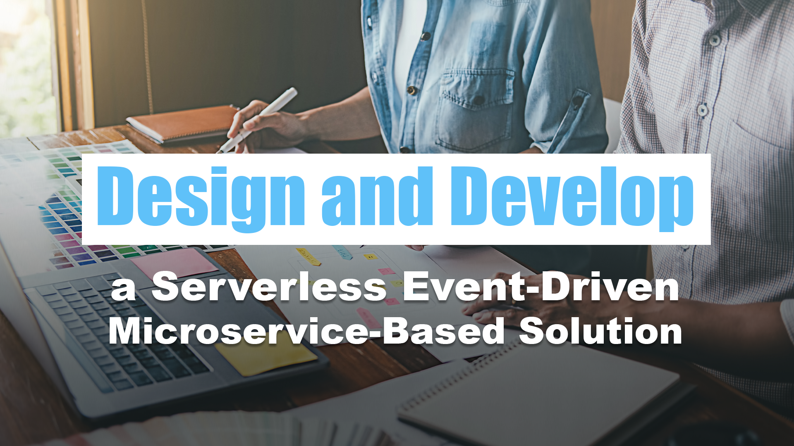

## Short Abstract
Hands-on full-day workshop where you will design, develop, and publish a serverless event-driven microservice-based solution.

## Abstract
You have heard all the buzzwords such as microservices, event-driven architecture, serverless, etc. You probably have attended sessions that talk about these terms. But how do you put all that together?

During this full-day workshop, you will start by designing a solution using serverless and event-driven cloud services using microservice patterns. Then you will build that solution using .NET, Azure services, and other best-practice tools. Finally, you will deploy that solution to the cloud so your customers can reap the rewards of a well-architected, reliable, and scalable solution that meets their needs today and provides for growth in the future.

# Type
- Full-day workshop

## Tags
- .NET
- APIs
- Application Development
- Architecture
- Azure
- Azure Event Hubs
- Azure Functions
- Azure Service Bus
- C#
- Cloud
- Cloud Architecture
- Cloud Computing
- Cloud Development
- Cloud Integration
- Cloud Resources
- Cloud Services
- Cloud Solutions
- Cloud-Native
- Cloud-Native Services
- Event Processing
- Event-driven
- Event-Driven Architecture
- Event-Driven Solutions
- Hands-on Training
- Hands-on Workshop
- Microservices
- Microsoft
- Microsoft Azure
- Performance Optimization
- Real-Time Event Processing
- Reliability
- REST
- Scalability
- Scalable Architectures
- Security
- Serverless
- Serverless Computing
- Software Design
- Software Development
- Technology
- Training
- Workshop

## Learning Objectives
- Understand the different serverless, event-driven cloud services and how to put them together to build a cohesive microservice-based architecture
- Build a working serverless event-driven microservice-based solution using best practices based upon real-world experience of what has worked and what has not
- Get hands-on experience deploying the solution you have built using continuous integration/continuous development tools that make it easy to keep your solution updated with the latest changes

## Presentations

| Event | Location | Date | Time | Room | Downloads |
|-------|:--------:|-----:|-----:|-----:|----------:|
| Code Mash | Sandusky, OH | January 10, 2024 | 8:00 am EST |	Cyprus | Available Afterwards |
| TashBash | Pocono Manor, PA | November 7, 2023 | 8:00 am EDT |	TBA | Coming Soon |
| dev up  (Canceled) | St. Charles, MO | August 30, 2023 | 8:30 am CDT |	Junior Ballroom C | Canceled |
| Beer City Code | Grand Rapids, MI | August 4, 2023 | 9:00 am EDT |	Room 264 | Coming Soon |

Email [chadgreen@chadgreen.com](mailto:chadgreen@chadgreen.com?subject=Presentation%20Request:%20Design%20and%20Develop%20a%20Serverless%20Event-Driven%20Microservice-Based%20Solution) to have Chad present this session at your event.
